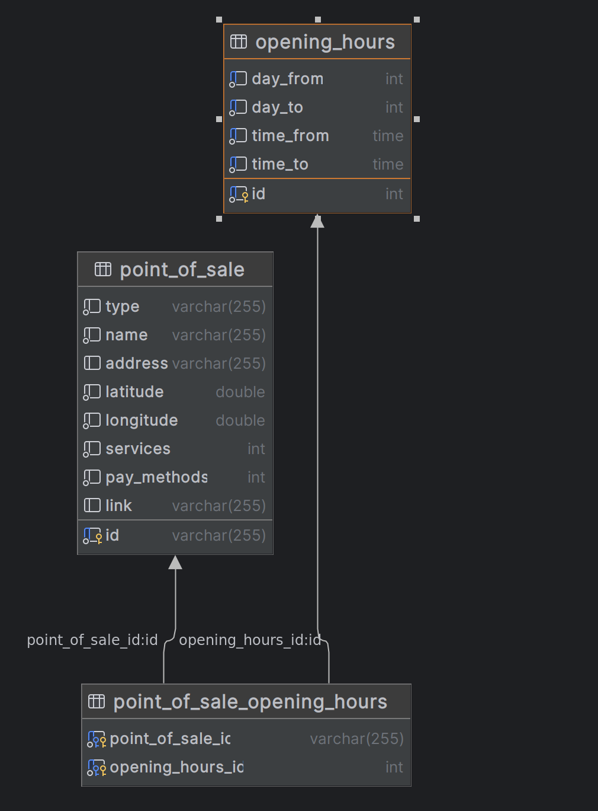

# PID API

## Description
The PID API is a web service that provides access to data about stores and their opening hours. The API is built on Symfony and uses SQL to store and retrieve data.

## Endpoints

### `/api/point/fetch`

- Method: `GET`
- Description: Fetches a list of stores into the database.
- Parameters: None
- Example of use: `curl http://localhost/api/point/fetch`

### `/api/point/`

- Method: `GET`
- Description: Returns a list of all stores.
- Parameters: None
- Example use: `curl "http://localhost/api/point/"`

### `/api/point/opened`

- Method: `GET`
- Description: Returns a list of stores that are open at a given time and date.
- Parameters:
    - `time`: Time in the format `HH:MM`. If not set, the current time is used.
    - `date`: Date in the format `YYYY-MM-DD`. If not set, the current date is used.
- Example use: `curl "http://localhost/api/point/opened?time=10:00&date=2022-12-31"`

# SQL Schema
The SQL schema is defined in the file `schema.sql`. 
